# Factory Pattern Class Diagram

This diagram visualizes how the **Factory Pattern** decouples the client (`LogisticServiceWithFactory`) from the concrete product implementations (`Air`, `Roads`, `Trains`) by delegating the creation logic to `LogisticsFactory`.

```mermaid
classDiagram
    %% Interface
    class Logistics {
        <<interface>>
        +send() void
    }

    %% Concrete Products
    class Air {
        +send() void
    }
    class Roads {
        +send() void
    }
    class Trains {
        +send() void
    }

    %% Factory
    class LogisticsFactory {
        +createLogistics(mode: String)$ Logistics
    }

    %% Client
    class LogisticServiceWithFactory {
        +LogisticServiceWithFactory(mode: String)
    }

    %% Relationships
    Logistics <|.. Air : implements
    Logistics <|.. Roads : implements
    Logistics <|.. Trains : implements
    
    LogisticsFactory ..> Logistics : creates >
    LogisticsFactory ..> Air : instantiates
    LogisticsFactory ..> Roads : instantiates
    LogisticsFactory ..> Trains : instantiates

    LogisticServiceWithFactory ..> LogisticsFactory : uses >
    LogisticServiceWithFactory ..> Logistics : uses >
```

### Key Takeaways:
1. **`LogisticServiceWithFactory`** only knows about the `LogisticsFactory` and the `Logistics` interface. It does **not** know about `Air`, `Roads`, or `Trains`.
2. **`LogisticsFactory`** contains the `if-else` logic and is the only class that directly instantiates the concrete products.
3. Adding a new mode (e.g., `Sea`) simply means adding a new class implementing `Logistics` and adding one more condition inside `LogisticsFactory`. No changes are required in `LogisticServiceWithFactory`.
